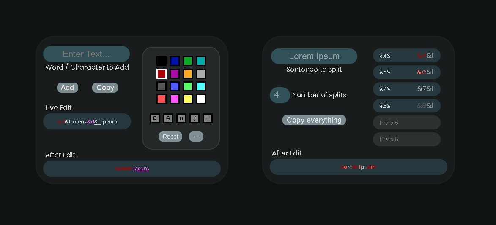

# Minecraft Color Code Generator 🎨

A web-based generator that allows you to visually create styled Minecraft text using **color codes**, **formatting**, and **prefixes** — with live preview and easy copying.

---

## 🚀 Features

- 🎨 **Pick from Minecraft's 16 classic colors**
- 🅱️ Bold, *Italic*, ~~Strikethrough~~, and _Underline_ styles
- 🔠 Split any sentence into styled parts with up to 6 prefixes
- 🔁 Live preview and after-edit rendering
- 📋 One-click "Copy Everything" functionality

---

## ✨ How It Works

### 🔤 Entering Text

- Type a sentence or word in the **"Enter Text"** box on the left
- Optionally add extra formatting or words with the **"Add"** button

### 🎨 Styling

Use the **color palette** and **style buttons** below to generate Minecraft formatting codes, which get prepended to the input text:
- Example: Clicking light red + bold = `&c&l`

### 📐 Splitting

In the right panel:
- Enter the sentence you want to **split** (e.g., `Lorem Ipsum`)
- Choose how many **prefixes** to apply (up to 6)
- Each prefix (like `&4&l`) will apply to every nth letter based on the split count

---

## 🔠 Color Codes Reference

| Code | Color Name     | Example        |
|------|----------------|----------------|
| `&0` | Black          | `&0Text`       |
| `&1` | Dark Blue      | `&1Text`       |
| `&2` | Dark Green     | `&2Text`       |
| `&3` | Dark Aqua      | `&3Text`       |
| `&4` | Dark Red       | `&4Text`       |
| `&5` | Dark Purple    | `&5Text`       |
| `&6` | Gold           | `&6Text`       |
| `&7` | Gray           | `&7Text`       |
| `&8` | Dark Gray      | `&8Text`       |
| `&9` | Blue           | `&9Text`       |
| `&a` | Green          | `&aText`       |
| `&b` | Aqua           | `&bText`       |
| `&c` | Red            | `&cText`       |
| `&d` | Light Purple   | `&dText`       |
| `&e` | Yellow         | `&eText`       |
| `&f` | White          | `&fText`       |

---

## 🔤 Format Codes

| Code | Effect          | Example         |
|------|------------------|-----------------|
| `&l` | **Bold**         | `&lBold`        |
| `&o` | *Italic*         | `&oItalic`      |
| `&n` | _Underline_      | `&nUnderline`   |
| `&m` | ~~Strikethrough~~| `&mStrike`      |
| `&k` | Obfuscated       | `&kSecret`      |
| `&r` | Reset formatting | `&rNormal`      |

---

